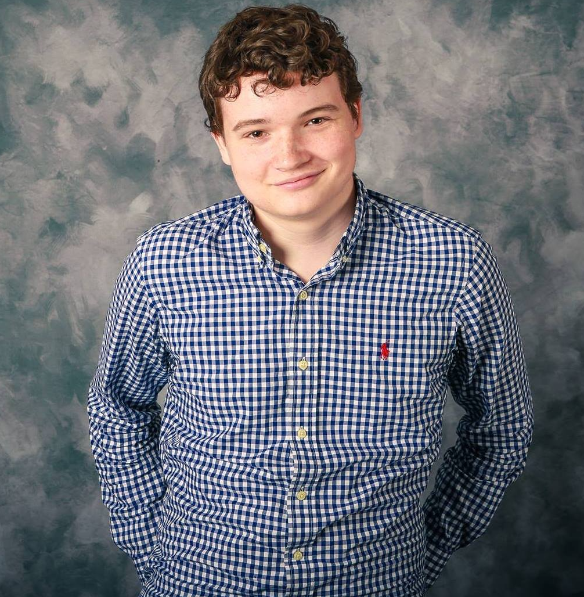

# Ryan Dwyer - Creative Techologist & Platform Engineer

Hi there! I'm a Computer Scientist trained in video game development with professional on-set experience in XR and Virtual Production. My areas of expertise include DevOps, Site Reliability Engineering, and Platform Engineering.

I currently reside in Los Angeles where I work for [Lucasfilm](https://www.lucasfilm.com/) as a Production Engineer on the Platform team. I will be moving to New York City around March of 2026.

While you're here, check out my [portfolio](http://rydwy.com/#/portfolio ':target=_self')!
